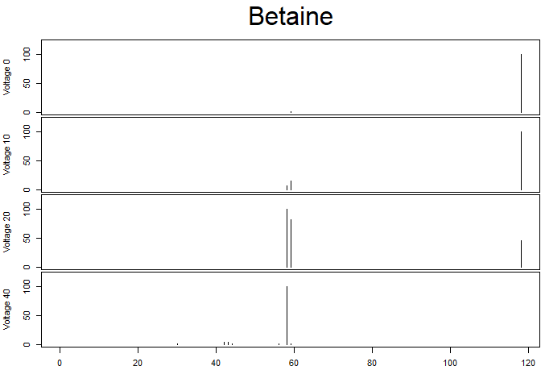
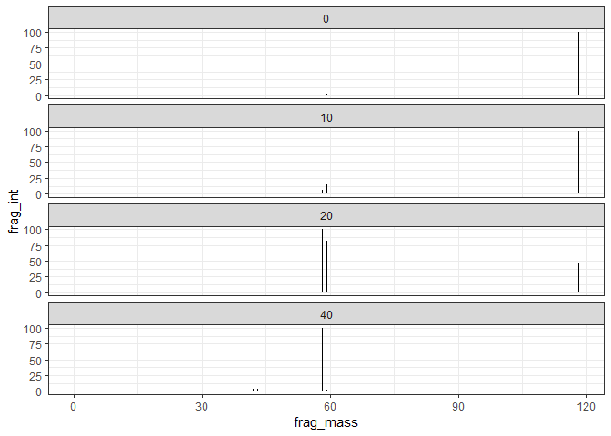

getMetlinVignette
================
William Kumler

### Intro

Metlin’s got a ton of useful data, but it’s trapped behind a weird
interactive Javascript thing in their website. The functions here allow
the retrieval of arbitrary amounts of data from the website in a
scripted fashion.

NOTE: Metlin has some rate-limitations in place that, if exceeded, will
block an IP for about a day. I triggered this while trying to pull down
the data for 100 compounds within a minute, and haven’t played with it
beyond that. I’m not sure how generous or aggressive the limits actually
are.

The full code for each function is available at the bottom of this
vignette.

### Get data for a given compound name or mass

When called, **getMetlinMz** and **getMetlinName** will print out some
diagnostic information about the number of compounds found and general
structural info. The object *returned* by the function is a data frame
with columns for Metlin’s internal compound ID, the exact mass of the
compound, and the compound name, formula, CAS and KEGG numbers. The
final column tells you whether they have MS/MS data for the given
compound.

**getMetlinName** tends to be a little overeager, and may return
compounds that are only vaguely related to your search. This is a
function of Metlin’s name search algorithm, not this code, and you’d get
the same results via the Advanced Search function on the Metlin website.

``` r
mass_data <- getMetlinMz(117.078979)
```

    ## [1] "Metlin returned 145 compound(s) between 117.078686302552 and 117.079271697448 m/z with 1 unique formula(s): C5H11NO2"
    ## [1] "Of those, 5 have experimental MS/MS data: L-Valine, Betaine, N-Methyl-a-aminoisobutyric acid, 5-Aminopentanoic acid, L-Norvaline"

``` r
str(mass_data)
```

    ## 'data.frame':    145 obs. of  7 variables:
    ##  $ cmpd_id   : Factor w/ 145 levels "263498","266763",..: 25 7 100 109 111 31 32 33 34 99 ...
    ##  $ exact_mass: Factor w/ 4 levels "117.078965","117.078978592",..: 3 3 4 3 3 1 1 1 3 3 ...
    ##  $ cmpd_name : Factor w/ 144 levels "(1,3,4,4'-~14~C_4_)Valine",..: 99 69 120 94 63 60 61 55 39 57 ...
    ##  $ formula   : Factor w/ 1 level "C5H11NO2": 1 1 1 1 1 1 1 1 1 1 ...
    ##  $ CAS       : Factor w/ 7 levels "","1119-48-8",..: 6 4 1 1 1 1 1 1 1 2 ...
    ##  $ KEGG      : Factor w/ 9 levels "","C00183","C00431",..: 2 4 1 7 3 1 1 1 5 8 ...
    ##  $ MSMS      : Factor w/ 2 levels "experimental",..: 1 1 1 2 1 2 2 2 2 2 ...

``` r
head(mass_data)
```

    ##   cmpd_id    exact_mass                       cmpd_name  formula      CAS
    ## 1      35 117.078978601                        L-Valine C5H11NO2  72-18-4
    ## 2     287 117.078978601                         Betaine C5H11NO2 590-46-5
    ## 3    6508    117.078979 N-Methyl-a-aminoisobutyric acid C5H11NO2         
    ## 4    6762 117.078978601                 isoamyl nitrite C5H11NO2         
    ## 5    6902 117.078978601           5-Aminopentanoic acid C5H11NO2         
    ## 6   35940    117.078965          4R-aminopentanoic acid C5H11NO2         
    ##     KEGG         MSMS
    ## 1 C00183 experimental
    ## 2 C00719 experimental
    ## 3        experimental
    ## 4 C07457           NO
    ## 5 C00431 experimental
    ## 6                  NO

``` r
name_data <- getMetlinName("Betaine")
```

    ## [1] "Metlin returned 35 compound(s) with name Betaine  with 33 unique formula(s): C11H21NO9, C12H17NO3, C12H17NO5, C16H12ClNO3, C16H15NO3S, C17H15NO3, C18H15NO5, C18H34N2O3, C26H53NO2, C42H81NO7, C42H81NO8, C44H81NO7, C46H79NO8, C48H83NO7, C4H9O2Se, C5H10N2S2, C5H11AsO2, C5H11NO, C5H11NO2, C5H11O2Se, C5H12ClNO, C5H12ClNO2, C5H12NO, C5H13NO3, C6H13AsO3, C6H13NO2, C6H14NO2, C7H13NO2, C7H14Cl3NO4, C7H15NO2, C7H15NO3, C9H20NO2, C9H22INO2"
    ## [1] "Of those, 5 have experimental MS/MS data: L-Carnitine, Betaine aldehyde, Betaine, Arsenobetaine, gamma-Butyrobetaine Ethyl Ester Chloride"

``` r
str(name_data)
```

    ## 'data.frame':    35 obs. of  7 variables:
    ##  $ cmpd_id   : Factor w/ 35 levels "274636","278",..: 23 2 3 35 28 18 19 20 27 29 ...
    ##  $ exact_mass: Factor w/ 35 levels "101.084063979",..: 12 1 4 10 9 31 33 35 5 16 ...
    ##  $ cmpd_name : Factor w/ 32 levels "1-Piperazinecarbodithioic acid",..: 23 8 7 3 28 20 21 19 6 4 ...
    ##  $ formula   : Factor w/ 33 levels "C11H21NO9","C12H17NO3",..: 31 18 19 30 28 10 12 14 26 17 ...
    ##  $ CAS       : Factor w/ 10 levels "","407-64-7",..: 4 9 5 2 1 1 1 1 7 6 ...
    ##  $ KEGG      : Factor w/ 8 levels "","C00318","C00576",..: 2 3 4 5 7 1 1 1 6 8 ...
    ##  $ MSMS      : Factor w/ 3 levels "","experimental",..: 2 2 2 1 3 3 3 3 3 2 ...

``` r
head(name_data)
```

    ##   cmpd_id    exact_mass                       cmpd_name   formula
    ## 1      52 161.105193351                     L-Carnitine  C7H15NO3
    ## 2     278 101.084063979                Betaine aldehyde   C5H11NO
    ## 3     287 117.078978601                         Betaine  C5H11NO2
    ## 4     966 145.110278729 4-Trimethylammoniobutanoic acid  C7H15NO2
    ## 5    7089 143.094628665                 Proline betaine  C7H13NO2
    ## 6   46617 711.601303951                 DGTS(16:0/16:0) C42H81NO7
    ##         CAS   KEGG         MSMS
    ## 1  541-15-1 C00318 experimental
    ## 2 7418-61-3 C00576 experimental
    ## 3  590-46-5 C00719 experimental
    ## 4  407-64-7 C01181             
    ## 5           C10172           NO
    ## 6                            NO

### Get MS/MS data for a given compound

After a preliminary search has been established, compounds with
“experimental” in the MSMS column can be searched again for the MS/MS
data specifically. **getMetlinMS2** accepts the unique Metlin ID for a
compound and returns a data frame with all MS/MS data in long format.
The columns are “polarity” (either “+” or “-”, depending on the polarity
the data was collected in), “adduct” ( usually “\[M+H\]” or “\[M-H\]”),
“voltage” (the voltage of the collision cell - higher voltages
typically produce smaller fragments), and finally each fragment’s mass
and intensity as “frag\_mass” and “frag\_int”, respectively. Intensity
is normalized to the highest peak, and therefore scaled from 100.

``` r
#Preliminary search for a compound
name_data <- getMetlinName("Betaine")
```

    ## [1] "Metlin returned 35 compound(s) with name Betaine  with 33 unique formula(s): C11H21NO9, C12H17NO3, C12H17NO5, C16H12ClNO3, C16H15NO3S, C17H15NO3, C18H15NO5, C18H34N2O3, C26H53NO2, C42H81NO7, C42H81NO8, C44H81NO7, C46H79NO8, C48H83NO7, C4H9O2Se, C5H10N2S2, C5H11AsO2, C5H11NO, C5H11NO2, C5H11O2Se, C5H12ClNO, C5H12ClNO2, C5H12NO, C5H13NO3, C6H13AsO3, C6H13NO2, C6H14NO2, C7H13NO2, C7H14Cl3NO4, C7H15NO2, C7H15NO3, C9H20NO2, C9H22INO2"
    ## [1] "Of those, 5 have experimental MS/MS data: L-Carnitine, Betaine aldehyde, Betaine, Arsenobetaine, gamma-Butyrobetaine Ethyl Ester Chloride"

``` r
#Access compound ID for the actual compound we'd like to get MS/MS data for
betaine_data <- name_data[3,]
betaine_id <- as.numeric(as.character(betaine_data$cmpd_id))

#Request ms2 data
betaine_ms2 <- getMetlinMS2(betaine_id)
```

    ## [1] "Metlin had 7 MS2 records for this compound, with collision energies of +0, +10, +20, +40, -0, -10, -20"

``` r
str(betaine_ms2)
```

    ## 'data.frame':    36 obs. of  5 variables:
    ##  $ polarity : Factor w/ 2 levels "+","-": 1 1 1 1 1 1 1 1 1 1 ...
    ##  $ adduct   : Factor w/ 2 levels "[M+H]","[M-H]": 1 1 1 1 1 1 1 1 1 1 ...
    ##  $ voltage  : num  0 0 0 10 10 10 10 20 20 20 ...
    ##  $ frag_mass: num  118.2 118.1 59.1 118.2 118.1 ...
    ##  $ frag_int : num  1.288 100 0.577 1.132 100 ...

``` r
head(betaine_ms2)
```

    ##   polarity adduct voltage frag_mass   frag_int
    ## 1        +  [M+H]       0 118.18648   1.287930
    ## 2        +  [M+H]       0 118.08649 100.000000
    ## 3        +  [M+H]       0  59.07405   0.577332
    ## 4        +  [M+H]      10 118.18640   1.132290
    ## 5        +  [M+H]      10 118.08641 100.000000
    ## 6        +  [M+H]      10  59.07396  14.351600

### Plot the data (base R)

``` r
# Base R plotting
# Split the data frame into each voltage and look at only one polarity
split_volt_pos_ms2 <- betaine_ms2 %>%
  subset(polarity=="+") %>%
  split(.$voltage)
# Arrange the output nicely
layout(matrix(c(1, rep(2:(length(split_volt_pos_ms2)+1), each=2),  1), ncol = 1))
par(mar=c(0.1, 4.1, 0.1, 0.1))
plot.new()
# Aaaaaand plot each voltage
text(x = 0.5, y=1, labels = betaine_data$cmpd_name, cex=3)
for(i in split_volt_pos_ms2){
  plot(i$frag_mass, i$frag_int, xlab = "", 
       ylab=paste("Voltage", unique(i$voltage)),
       xlim=c(0, max(betaine_ms2$frag_mass)), 
       xaxt="n", yaxt="n", type="n", ylim=c(0, 120))
  segments(x0 = i$frag_mass, x1 = i$frag_mass,
           y0 = 0, y1 = i$frag_int)
  axis(side = 2, at = c(0, 50, 100), labels = c(0, 50, 100))
}
axis(side = 1)
```

<!-- -->

### Plot the data (ggplot method)

``` r
library(ggplot2)
```

    ## Registered S3 methods overwritten by 'ggplot2':
    ##   method         from 
    ##   [.quosures     rlang
    ##   c.quosures     rlang
    ##   print.quosures rlang

``` r
betaine_ms2 %>%
  filter(polarity=="+") %>%
    #filter(voltage==20) %>%
    ggplot(label=frag_mass) +
    geom_segment(aes(yend=0, x=frag_mass, y=frag_int, xend=frag_mass)) +
    #geom_hline(yintercept=0) +
    facet_wrap(~voltage, ncol = 1) +
    theme_bw() +
    xlim(0, max(betaine_ms2$frag_mass))
```

<!-- -->

The ggplots can also be saved and rendered interactively with
**ggplotly**, to mimic the interactive method available on the Metlin
website.

### getMetlin source code

``` r
library(dplyr)
library(httr)
library(xml2)

getMetlinMz <- function(cmpd_mz, ppm=2.5){
  if(!is.numeric(cmpd_mz)|cmpd_mz<=0){
    stop("Mass must be positive and numeric")
  }
  if(!is.numeric(ppm)|ppm<=0){
    stop("Mass must be positive and numeric")
  }
  
  
  mz_range <- c(cmpd_mz-cmpd_mz*ppm/1000000, cmpd_mz+cmpd_mz*ppm/1000000)
  metlin_data <- paste0("https://metlin.scripps.edu/advanced_search_result.php?",
                        "molid=&mass_min=", min(mz_range),
                        "&mass_max=", max(mz_range), "&Amino",
                        "Acid=add&drug=add&toxinEPA=add&keggIDFilter=add") %>%
    GET() %>%
    stop_for_status() %>%
    content(encoding = "UTF-8") %>%
    xml_find_all(xpath = "//tbody")
  
  search_ids <- metlin_data %>%
    xml_find_all(xpath = "//th[@scope]/a") %>%
    xml_text()
  
  search_data <- metlin_data %>%
    xml_find_all(xpath="//td") %>%
    xml_text() %>%
    matrix(ncol=7, byrow=T) %>%
    cbind(search_ids, .) %>%
    as.data.frame() %>%
    `names<-`(c("cmpd_id", "exact_mass", "cmpd_name", "formula",
                "CAS", "KEGG", "MSMS", "Structure")) %>%
    select(-Structure)
  
  MSMS_subset <- subset(search_data, MSMS=="experimental")
  
  print(paste("Metlin returned", nrow(search_data), "compound(s) between",
              min(mz_range), "and", max(mz_range), "m/z with",
              length(levels(search_data$formula)), "unique formula(s):",
              paste(levels(search_data$formula), collapse = ", ")))
  if(nrow(MSMS_subset)){
    print(paste("Of those,", nrow(MSMS_subset),
                "have experimental MS/MS data:",
                paste(as.character(MSMS_subset$cmpd_name), collapse = ", ")))
  } else {
    print("None of these compounds have experimental MS/MS data")
  }
  
  return(search_data)
}


getMetlinName <- function(name){
  metlin_data <- paste0("https://metlin.scripps.edu/advanced_search_result.php?",
                        "name=", name, "&AminoAcid=add&drug=add&toxinEPA=add&",
                        "keggIDFilter=add") %>%
    GET() %>%
    stop_for_status() %>%
    content(encoding = "UTF-8") %>%
    xml_find_all(xpath = "//tbody")
  
  search_ids <- metlin_data %>%
    xml_find_all(xpath = "//th[@scope]/a") %>%
    xml_text()
  
  search_data <- metlin_data %>%
    xml_find_all(xpath="//td") %>%
    xml_text() %>%
    matrix(ncol=7, byrow=T) %>%
    cbind(search_ids, .) %>%
    as.data.frame() %>%
    `names<-`(c("cmpd_id", "exact_mass", "cmpd_name", "formula",
                "CAS", "KEGG", "MSMS", "Structure")) %>%
    select(-Structure)
  
  MSMS_subset <- subset(search_data, MSMS=="experimental")
  
  print(paste("Metlin returned", nrow(search_data), "compound(s) with name",
              name, " with",
              length(levels(search_data$formula)), "unique formula(s):",
              paste(levels(search_data$formula), collapse = ", ")))
  if(nrow(MSMS_subset)){
    print(paste("Of those,", nrow(MSMS_subset),
                "have experimental MS/MS data:",
                paste(as.character(MSMS_subset$cmpd_name), collapse = ", ")))
  } else {
    print("None of these compounds have experimental MS/MS data")
  }
  
  return(search_data)
}


getMetlinMS2 <- function(cmpd_id){
  if(!is.numeric(cmpd_id)|cmpd_id<=0){
    stop("Mass must be positive and numeric")
  }
  metlin_data <- paste0("https://metlin.scripps.edu/showChart.php?molid=",
                        cmpd_id,"&etype=experimental") %>%
    GET() %>% stop_for_status()
  ms2_raw <- metlin_data %>%
    content(encoding = "UTF-8") %>%
    xml_find_all(xpath = '/html/head/script[5]') %>%
    xml_text() %>%
    gsub(pattern = ".*series: \\[", replacement = "") %>%
    gsub(pattern = " ]}]\n                }); \n\n            });\n        ",
         replacement = "") %>%
    gsub(pattern = "&nbsp;", replacement = "") %>%
    strsplit(split = "\\{name: ") %>%
    unlist() %>%
    `[`(-1) %>%
    lapply(strsplit, split=",data:\\[")
  
  if(!length(ms2_raw)){stop("No MS2 data found. Are you sure Metlin has this data?")}
  
  ms2_titles <- sapply(ms2_raw, `[[`, 1)[1,] #Not sure why this works but OK
  ms2_polarities <- ifelse(grepl(ms2_titles, pattern = "(\\+)"), "+", "-")
  ms2_voltages <- gregexpr("\\d+\\.?\\d*", ms2_titles) %>%
    regmatches(x=ms2_titles) %>%
    unlist() %>% as.numeric()
  ms2_adducts <- gregexpr("\\[M.*\\]", ms2_titles) %>%
    regmatches(x = ms2_titles) %>%
    unlist()
  
  ms2_list <- sapply(ms2_raw, `[[`, 1)[2,] %>%
    gsub(pattern = " ]},", replacement = "") %>%
    lapply(function(x){
      wo1 <- substring(x, 2)
      wo2 <- substring(wo1, 1, nchar(wo1))
      ms2_list <- unlist(strsplit(wo2, "},\\{"))
      ms2_list <- lapply(ms2_list, function(x)
        as.numeric(unlist(regmatches(x, m = gregexpr("\\d+\\.?\\d*", x)))))
      ms2_df <- as.data.frame(do.call(rbind, ms2_list))
      names(ms2_df) <- c("mass", "rel_intensity")
      return(ms2_df)
    })
  for(i in seq_along(ms2_list)){
    ms2_list[[i]] <- cbind(ms2_polarities[i], ms2_adducts[i],
                           ms2_voltages[i], ms2_list[[i]])
  }
  ms2_df <- as.data.frame(do.call(rbind, ms2_list))
  names(ms2_df) <- c("polarity", "adduct", "voltage", "frag_mass", "frag_int")
  
  print(paste("Metlin had", length(ms2_titles), "MS2 records for this compound,",
              "with collision energies of",
              paste(paste0(ms2_polarities, ms2_voltages), collapse=", ")))
  
  return(ms2_df)
}
```
